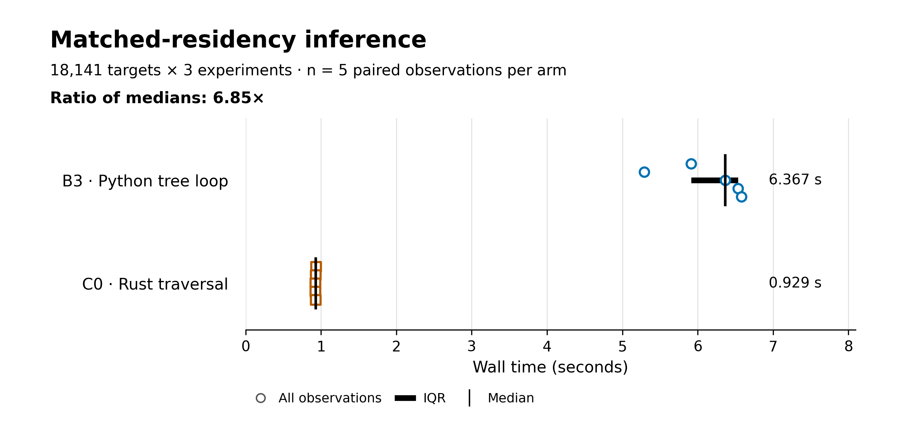
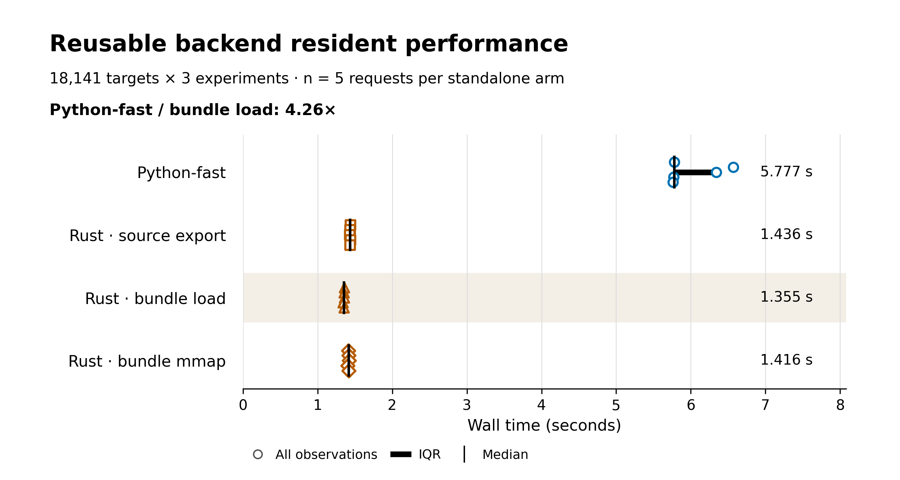
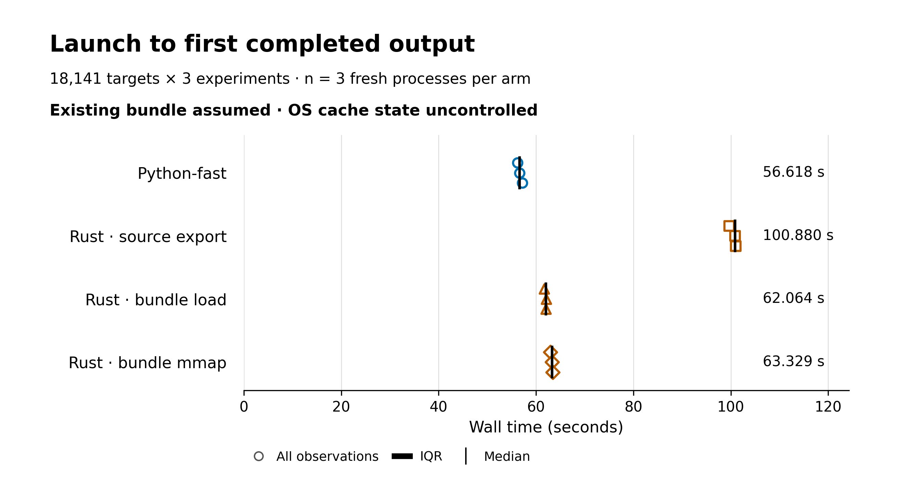
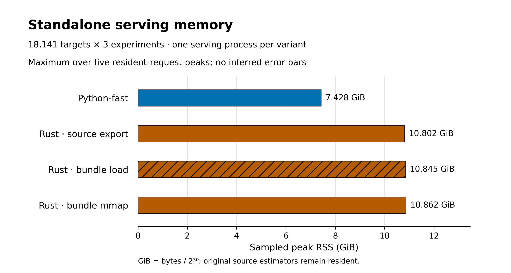
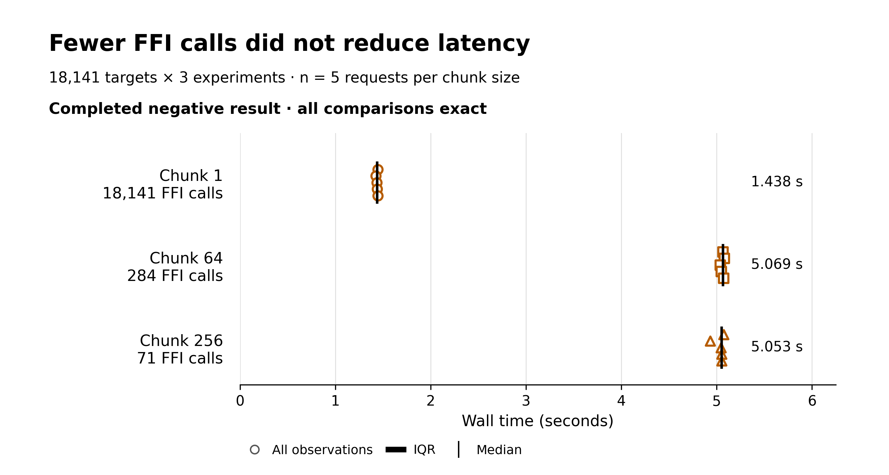

# Figure captions and alt text

All figures are generated from one accepted Phase 2 allocation. CPU inference used one compute worker on AMD EPYC 9B45 with BLAS/OpenMP thread counts fixed to one; the allocated GPU was unused. No new inference was performed for this publication.

## Figure 1. Matched-residency inference

**Caption.** Five paired observations for B3 (Python tree loop) and C0 (Rust traversal), with both adapters and common source models already resident. Each request covers 18,141 targets × the original three experiment columns. Open symbols show every observed wall time; thick horizontal intervals show the interquartile range (Q1–Q3); vertical ticks and labels show the median. Quartiles use linear interpolation at (n − 1) × q. The ratio of the unrounded medians is 6.850887×. This is a matched-residency reproduction of the earlier Rust comparison, not an additional improvement over a previous Rust version. Original A includes repeated loading and is deliberately excluded from this chart.

**Alt text.** Five B3 observations have median 6.367 seconds; five C0 observations have median 0.929 seconds.

[SVG](matched_residency.svg) · [PDF](matched_residency.pdf) · [300-dpi PNG](matched_residency.png)

**Provenance.** [`phase2_timings.jsonl`](../benchmarks/data/phase2_timings.jsonl), records p2-016, p2-017, p2-018, p2-019, p2-020, p2-021, p2-022, p2-023, p2-024, p2-025. Filter: run `phase2`, group `matched_resident`, arms `B3, C0`, 18,141 targets, three experiments. Field(s): `record.wall_seconds`. Boundary: CSV parsing through closed/flushed original-schema CSV; no fsync; source models and adapters already resident; correctness outside timing. Formula: all observations; median; Q1 and Q3 by linear interpolation at (n-1)*q; ratio of unrounded arm medians. Units: seconds. Public source SHA-256: `2df607d39f7566eff8301851c7f7e41da68fd7433de535d831258e77bc9d2614`. Per-original-file hashes are in [`provenance.json`](provenance.json).

## Figure 2. Reusable backend resident performance

**Caption.** Five repeated requests per packaged variant in its own standalone worker after its accepted first output, using all 18,141 targets and three experiment columns. Every request parses the feature CSV, performs fresh selection, input validation and inference, constructs z-scores/table, and closes the output CSV. Symbols, IQR intervals and median ticks are defined as in Figure 1. Ordinary bundle loading at chunk size 1 is highlighted as the measured resident-workload choice. Its ratio versus packaged Python-fast is 4.264521×; this is separate from the minimal B3/C0 benchmark. Original estimators remain required in both bundle modes.

**Alt text.** Four standalone resident groups show Python-fast near 5.78 seconds and Rust modes near 1.35–1.44 seconds; all five observations in each group are visible.

[SVG](reusable_resident.svg) · [PDF](reusable_resident.pdf) · [300-dpi PNG](reusable_resident.png)

**Provenance.** [`phase2_timings.jsonl`](../benchmarks/data/phase2_timings.jsonl), records p2-031, p2-032, p2-033, p2-034, p2-035, p2-036, p2-037, p2-038, p2-039, p2-040, p2-041, p2-042, p2-043, p2-044, p2-045, p2-046, p2-047, p2-048, p2-049, p2-050. Filter: run `phase2`, group `standalone_resident`, arms `packed_load, packed_mmap, source_python_fast, source_rust`, 18,141 targets, three experiments. Field(s): `record.wall_seconds`. Boundary: CSV parsing through closed/flushed original-schema CSV; no fsync; source models and adapters already resident; correctness outside timing. Formula: all observations; median; Q1 and Q3 by linear interpolation at (n-1)*q; ratio of unrounded arm medians. Units: seconds. Public source SHA-256: `2df607d39f7566eff8301851c7f7e41da68fd7433de535d831258e77bc9d2614`. Per-original-file hashes are in [`provenance.json`](provenance.json).

## Figure 3. Launch to first completed output

**Caption.** Three fresh-process trials per packaged variant. Timing begins in the parent immediately before process launch and ends on receipt of the event emitted just after the first CSV is closed/flushed, without fsync. Imports, verification, source-model loading, required export/page touching, inference and CSV construction are included. No candidate correctness prediction precedes the event. Open symbols show all trials; intervals show linear Q1–Q3 and ticks show medians. OS caches were uncontrolled; this is not a cold-storage measurement. Bundle modes assume an existing bundle. Downloads, environment/native builds, and the separately measured 99.145200479-second conversion/serialization/verification are excluded. Conversion is caption context, not a measured stacked timing segment.

**Alt text.** Python-fast starts in about 57 seconds, source-export Rust about 101 seconds, and existing-bundle Rust about 62–63 seconds; all three process trials are visible.

[SVG](startup_latency.svg) · [PDF](startup_latency.pdf) · [300-dpi PNG](startup_latency.png)

**Provenance.** [`phase2_timings.jsonl`](../benchmarks/data/phase2_timings.jsonl), records p2-051, p2-052, p2-053, p2-054, p2-056, p2-057, p2-058, p2-060, p2-061, p2-062, p2-064, p2-065. Filter: run `phase2`, group `process_first_output`, arms `packed_load, packed_mmap, source_python_fast, source_rust`, 18,141 targets, three experiments. Field(s): `record.wall_seconds`. Boundary: parent before Popen through first CSV-close event receipt; no fsync. Formula: all observations; median; Q1 and Q3 by linear interpolation at (n-1)*q. Units: seconds. Public source SHA-256: `2df607d39f7566eff8301851c7f7e41da68fd7433de535d831258e77bc9d2614`. Per-original-file hashes are in [`provenance.json`](provenance.json).

## Figure 4. Standalone serving memory

**Caption.** Each bar is the maximum of the five sampled resident-request RSS peaks in the corresponding standalone worker, sampled every 10 ms including descendants and excluding the orchestration parent (start/end samples are also retained). These are four maxima, not four estimated distributions; no error bars are inferred. GiB = bytes / 2^30. This chart does not use the shared B3/C0 process RSS or cache-budget accounting. Both bundle modes still retain source estimators for the legacy validator. The hatched bar denotes ordinary bundle loading.

**Alt text.** Standalone resident peak RSS is about 7.43 GiB for Python-fast and 10.80–10.86 GiB for Rust variants.

[SVG](standalone_memory.svg) · [PDF](standalone_memory.pdf) · [300-dpi PNG](standalone_memory.png)

**Provenance.** [`phase2_timings.jsonl`](../benchmarks/data/phase2_timings.jsonl), records p2-031, p2-032, p2-033, p2-034, p2-035, p2-036, p2-037, p2-038, p2-039, p2-040, p2-041, p2-042, p2-043, p2-044, p2-045, p2-046, p2-047, p2-048, p2-049, p2-050. Filter: run `phase2`, group `standalone_resident`, arms `packed_load, packed_mmap, source_python_fast, source_rust`, 18,141 targets, three experiments. Field(s): `record.memory.sampled_peak_rss_bytes`. Boundary: per-resident-request sampled RSS; maximum over five requests. Formula: maximum(sampled_peak_rss_bytes) / 2^30 per standalone arm. Units: GiB. Public source SHA-256: `2df607d39f7566eff8301851c7f7e41da68fd7433de535d831258e77bc9d2614`. Per-original-file hashes are in [`provenance.json`](provenance.json).

## Figure 5. Negative chunking result

**Caption.** Five balanced-order resident requests for each chunk size, using the same prepared source-model and mmap-array state. All 18,141 targets and three experiments are evaluated on every request. Symbols, IQR intervals and median ticks are defined as in Figure 1. Actual recorded FFI calls are 18,141, 284 and 71 for chunks 1, 64 and 256. Fewer calls did not reduce end-to-end latency in this implementation: larger chunks were slower while all completed comparisons remained exact. The complete slowdown has not been causally assigned to any single stage. Keep chunk size 1 as the measured default.

**Alt text.** Chunk 1 takes about 1.44 seconds despite 18,141 calls; chunks 64 and 256 take about 5.05–5.07 seconds with only 284 and 71 calls.

[SVG](negative_chunking.svg) · [PDF](negative_chunking.pdf) · [300-dpi PNG](negative_chunking.png)

**Provenance.** [`phase2_timings.jsonl`](../benchmarks/data/phase2_timings.jsonl), records p2-001, p2-002, p2-003, p2-004, p2-005, p2-006, p2-007, p2-008, p2-009, p2-010, p2-011, p2-012, p2-013, p2-014, p2-015. Filter: run `phase2`, group `chunk_resident`, arms `chunk1, chunk256, chunk64`, 18,141 targets, three experiments. Field(s): `record.wall_seconds, record.diagnostics.ffi_calls`. Boundary: CSV parsing through closed/flushed original-schema CSV; no fsync; source models and adapters already resident; correctness outside timing. Formula: all observations; median; Q1 and Q3 by linear interpolation at (n-1)*q. Units: seconds. Public source SHA-256: `2df607d39f7566eff8301851c7f7e41da68fd7433de535d831258e77bc9d2614`. Per-original-file hashes are in [`provenance.json`](provenance.json).

Conversion context comes from `context.json#/records/bundle_conversion`, whose original receipt hash and retained-field map are included in that public file. It is not an inference sample.
